# ROV Protocols

**Location:** Seattle Aquarium, Pier 59

This document provides instructions for safe ROV flight operations at Pier 59.
Please, inform us of any errors, confusion, suggestions, etc. We encourage collaboration and communication between CEaL, IT/AV, Dive Program, and CPP to keep these protocols up to date and improve them over time.

## Table of Contents

- [Gear Checklist](#gear-checklist)
- [1. Assessing topside and underwater conditions](#1-assessing-topside-and-underwater-conditions)
- [2. Set up topside flight area](#2-set-up-topside-flight-area)
- [3. Power ROV](#3-power-rov)
- [4. Stage for launch at the dive ramp](#4-stage-for-launch-at-the-dive-ramp)
- [5. Connect to the ROV](#5-connect-to-the-rov)
- [6. Deploy and fly the ROV](#6-deploy-and-fly-the-rov)
- [7. In-flight Operation](#7-in-flight-operation)
- [8. Docking, undocking, and wirelessly charging the ROV](#8-docking-undocking-and-wirelessly-charging-the-rov)
- [9. Retrieve ROV](#9-retrieve-rov)
- [10. Post-flight care](#10-post-flight-care)
- [Troubleshooting](#troubleshooting)
  - [BlueOS/Cockpit slow or glitching](#blueoscockpit-slow-or-glitching)
  - [Camera stream issues](#camera-stream-issues)
  - [Unable to open BlueOS](#unable-to-open-blueos)
  - [Controller not connecting to Cockpit](#controller-not-connecting-to-cockpit)
- [Points of Caution](#points-of-caution)
- [Supplemental Figures](#supplemental-figures)
  - [Manually Charge ROV Battery](#manually-charge-rov-battery)
  - [Cockpit User Interface (UI)](#cockpit-user-interface-ui)
  - [Piers 59 and 60 Underwater Map](#piers-59-and-60-underwater-map)

## Gear Checklist
1. ROV Cart and contents
3. ROV Laptop
4. AB1 Key
5. Radio
6. Cell phone
7. Personal Flotation Device (PFD; stored in closet opposite ramp)
8. Pop-up tent

## 1. Assessing topside and underwater conditions

-	Check weather, tides, and sea surface state before initiating flight protocol.
-	**Do not operate on a tide lower than 1 foot** (the ramp will be too steep / can’t reach the sea surface)
-	**Do not operate with winds greater than 15 knots** out of the north (blowing into you on flight deck).
	-	Winds out of the south are largely blocked by Pier 59, though you may have water movement / chop.
-	Check water conditions via docking station camera for visibility at-depth
	-	http://10.59.165.221/extensionv2/cockpitlite/#/
	-	**Do not fly if you have less than 1m of visibility**
-	Once you determine that conditions are good to fly, call Seattle Harbor Patrol at **(206)-684-4072** to notify them of your plans.
    -	"Hello, this is [insert name] with the Seattle Aquarium. We will be operating our Remotely Operated Vehicle over the side of the Aquarium from [time] to [time] today. We will operate between Piers 59 and 62 and do not intend to go past the end of Pier 59."

### Notes
-   There are a variety of ways to obtain information about the tide and wind. Two options include:
	-	Tides app on IOS
	-	WindFinder app on IOS

## 2. Set up topside flight area

-	Set up a pop-up tent to alleviate rain / bright sun (be mindful of wind).
-	Unlock ramp power box lever using AB1 key and power the ramp by moving the lever up to the “on” position.
-	Descend the ramp slightly, then ascend the ramp slightly to verify functioning.
-	Move cart to the dive ramp, positioned such that the cart is just to the right of the end of the ramp.
-	Plug in the cart to the power outlet.
-	Plug in the HDMI cord to the TV and ROV laptop.
-	Plug in the ROV laptop to the power strip within the cart.
-	Turn on and sign into the laptop, verify that TV extends computer screen.

## 3. Power ROV

- Check the status of the ROV battery with the voltage reader by connecting the white terminals to pins (-) - 4.

  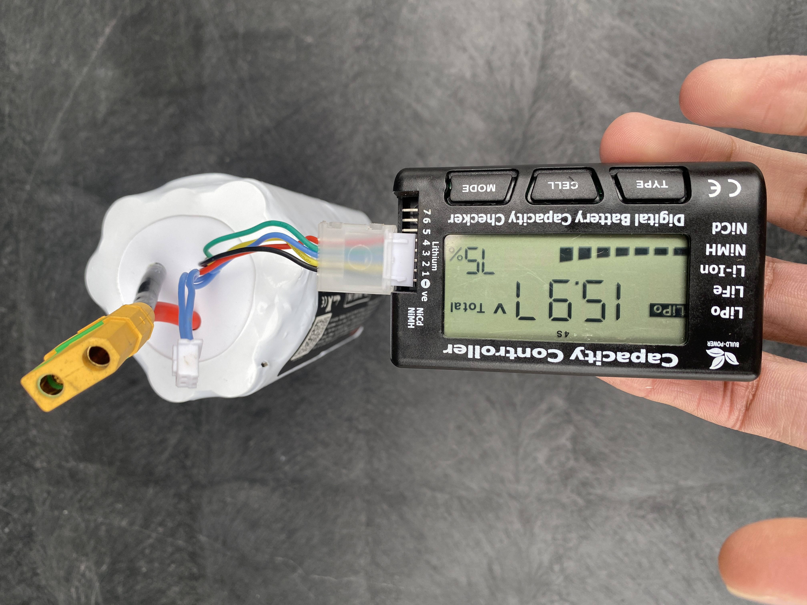 

- Pull out the battery enclosure lock (white cord with black ring poking out from top of battery enclosure).

  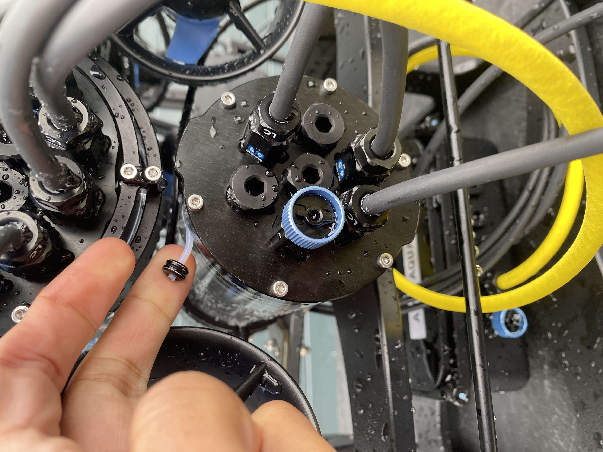 

  
- Remove the blue vent plug from battery enclosure and **set it somewhere safe.**
  - Note: there are three blue vent plugs on the ROV -- make sure to remove only the middle one for the battery enclosure and avoid the upper one on the electronics tube and lower on the recharge box.

  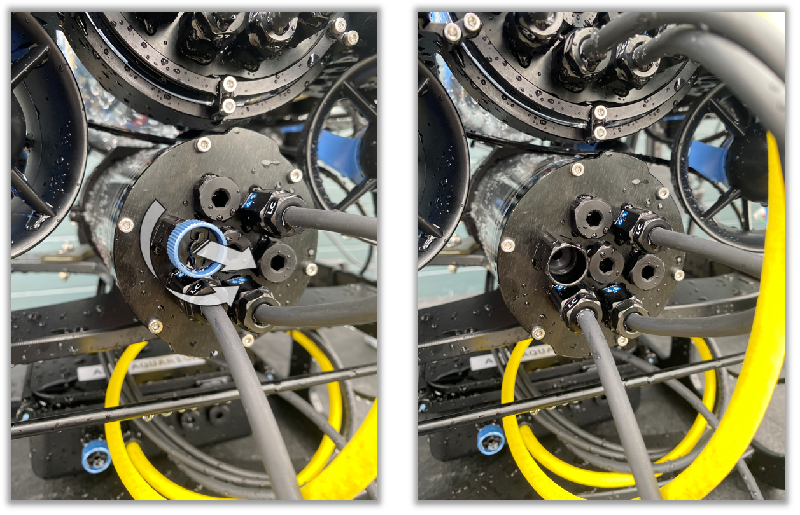 

- Use the small Blue Robotics enclosure key to gently open the ROV battery enclosure.
  - Find an opening groove between the end cap and battery enclosure, insert the middle protrusion of the key, then twist the key.

  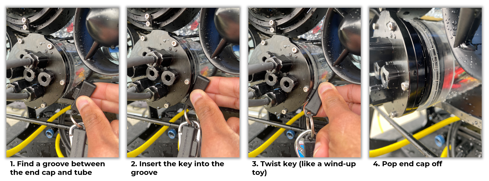 

 

- Pull the rear end cap off.
- **Check the status of silicone lubrication on the two rear endcap O-rings.**
  -	If they are dry and/or if removal of the end cap is challenging, you can either:
    -	Remove the O-rings with the O-ring pick, clean them with a dust cloth, apply silicone grease, reapply the O-rings, or 
    -	Apply a small amount of silicone grease to the outside of the x2 O-rings
  - Remove any hairs or particles from the O-rings as even small debris can compromise the seal and flood the battery enclosure.
    - Remove and clean with dust cloth if necessary, then reapply silicone grease and replace.
-	Connect the ROV battery: attach the ROV battery’s cell balancer connector **(white) first**, then connect the main connector (yellow). You should hear an initial chime when the battery is first connected, then a second chime approximately one minute later when the Pi and Navigator have fully booted. **The ROV will not be ready to fly until both series of chimes occur.**

  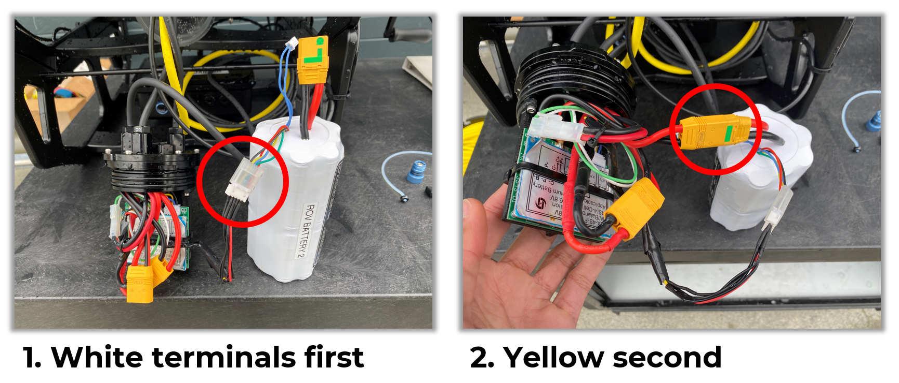 

 

- Gently replace the end cap; **the cap should rest flush against the tube**, with two solid black lines forming inside where the O-rings make contact with the tube.
- Care is required when re-connecting the end cap -- ensure that all cables are out of the way and that the end cap can seat properly, then match the rectangular notch to fit the groove in the acrylic tube. Pause if you feel resistance when attempting to replace the end cap.

  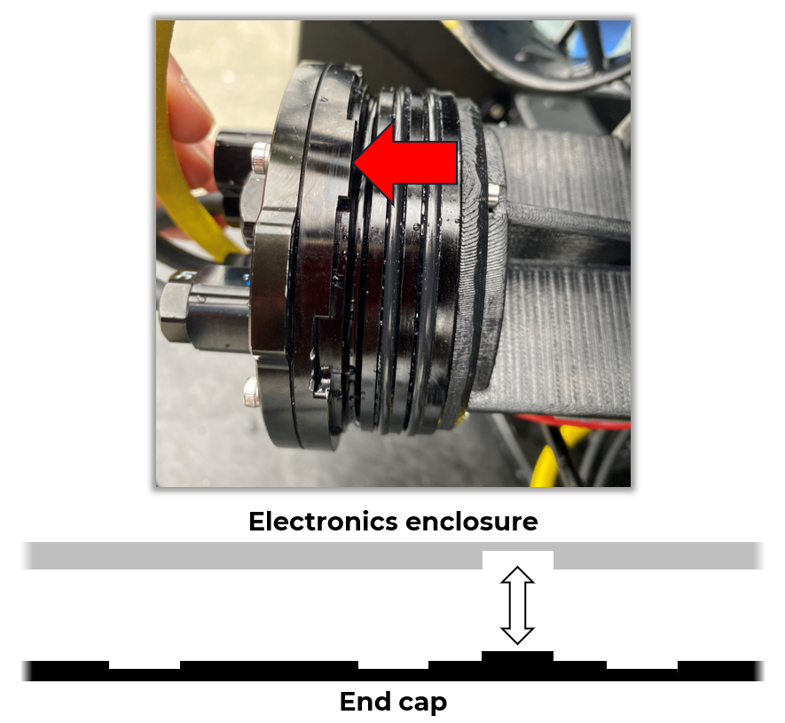 

 

- **Reattach and tighten the vent plug.**
- Replace the battery enclosure lock; **it will not go back into place unless the end cap has been replaced properly.**

### Notes
- Should you need to recharge the battery on land, follow these steps (see [Manually Charge ROV Battery](#manually-charge-rov-battery)):
	- Plug in the ROV battery charger.
	- Connect the white terminals first, then plug in the yellow connectors.
	- Allow the battery cells a few seconds to properly balance (the four numbers at the bottom of the screen should all be within .005 V of each other).
	- Press the circle button between up and down arrows on the right side of the device, then press again over the 'Start' option.
	- Monitor the battery's percentage as it charges; do not leave unattended for extended periods -- it will chime loudly once finished.
	- Once charged, press the circle button, then select the 'Stop' option.
	- You may then unplug the white and yellow connectors.

## 4. Stage for launch at the dive ramp

-	**Double-check that the tether is securely clipped to ROV** (i.e., that the tether is plugged in and that its carabiner is attached –- should you have to manually pull in the ROV mid-flight, this clip will better protect the tether from damage).

  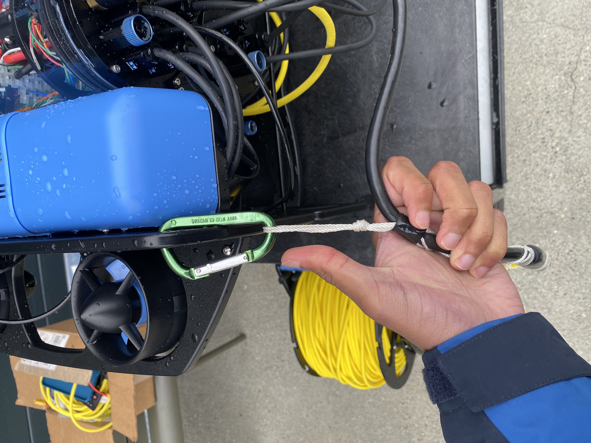 

-	You will require x2 people familiar with ramp operations –- the *Pilot* and the *Copilot* -– both personnel are **required to wear a Personal Floatation Device** (PFD; found on the inside door of the closet adjacent to the dive ramp) when walking on the ramp.
-	With the *Pilot* carrying the ROV and *Copilot* carrying the tether spool both walk out and place their items at the end of the ramp.
-	The *Copilot* stays at the end of the ramp; the *Pilot* returns to the cart, closing but not locking the ramp (keep the unlocked lock threaded in its spot so as not to lose it).
-	The *Copilot* hands the tether spool to the *Pilot* from the ramp, where, **upon handoff, the *Pilot* will verify their grip on the spool via a verbal “Got it!” before the *Copilot* releases their grip.**
-	The *Pilot* sets the tether on the ground to the left of the cart.

## 5. Connect to the ROV

- Connect the FXTI-Spool Connector to the FXTI box and tether spool:
  - Ensure the black end piece of the connector (with the lock icons) is turned all the way left before aligning the white arrow with the white line on both the spool and FXTI ports.
  - You must insert the cable and rotate the top piece into the "lock" position, otherwise the cable will eject.

  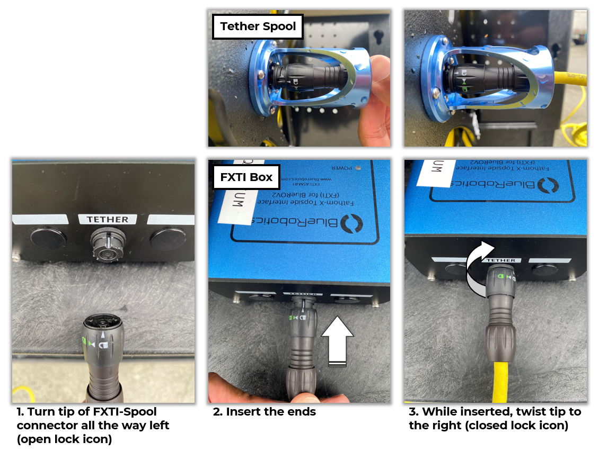 

-	**Ensure the connector is routed such that does not impede the tether**, i.e., ensure the tether can freely unspool.

  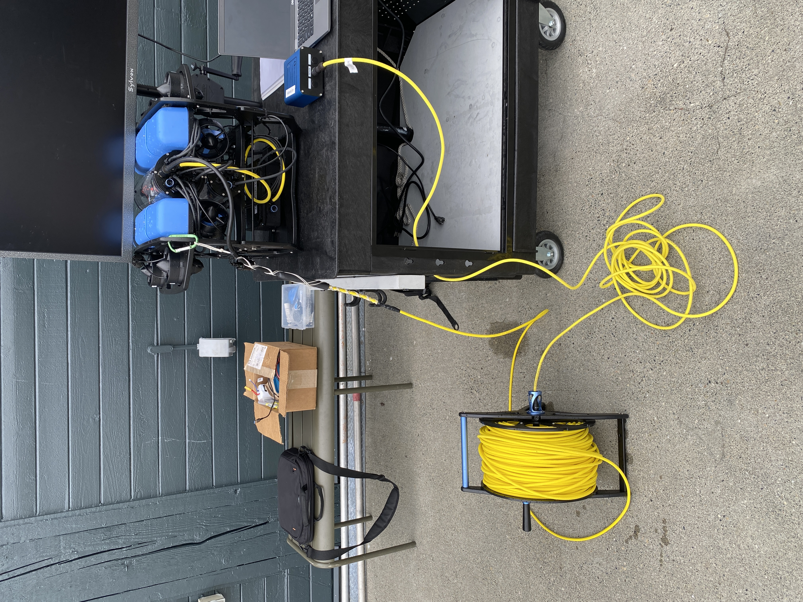 

-	Connect the ethernet-USB cable to the FXTI box and to the flight laptop’s USB port.
-	Connect the Xbox controller to another flight laptop USB port.
-	Access BlueOS by opening Chrome and proceeding to `192.168.2.2` (type this directly into the search bar).
	-	Verify BlueOS connection.
		- If the page does not load, wait a moment, then close the tab and try unplugging and re-plugging the FXTI USB wire.
	- Verify ROV voltage and heartbeat from the BlueOS homepage by clicking the heart icon on the top right.

  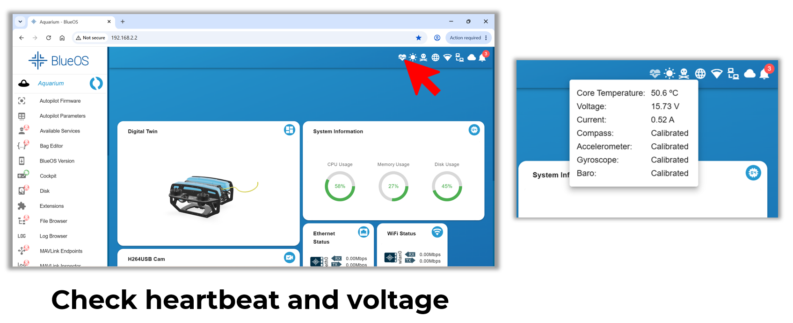 

-	Open desktop application "Cockpit", or, if the desktop version proves challenging, default to "Cockpit Lite" found on the BlueOS homepage (it will open in a browser tab).
	-	Select "Aquarium" from the profile prompt.
	-	Verify camera feed is visible on-screen.
	-	Use the Xbox controller to arm the vehicle.

  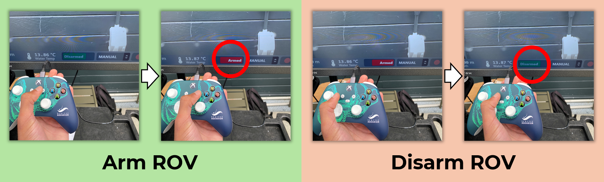 

-	- Verify control: check "pilot gain" (AKA thrust power; hereafter referred to as "gain") seen on the left side of the bottom ribbon (see [Cockpit UI](#cockpit-user-interface-ui)), adjust to `30%`.
	- Briefly activate thrusters.
	- (Optional) Cycle lights up and down.
-	The vehicle is now ready to deploy.

## 6. Deploy and fly the ROV

-	*Pilot* lowers ramp with *Copilot* and ROV until just above water level.
-	*Copilot* makes a final check to ensure vent plugs are in place and tight.
-	*Copilot* issues a verbal “**Are you ready?**” to the *Pilot*.
- *Pilot* verifies that the vehicle is **armed and set to "Manual" flight mode**.
-	*Copilot* gently sets the ROV in the water.
- *Copilot* returns to cart and ascends the ramp to be slightly above the water line.
-	*Pilot* motors the ROV on the surface northwest (using compass on Cockpit UI) about 10 meters away from the ramp and ascent piling (see [Points of Caution](#points-of-caution)); visually confirms ROV flight controls are responding as expected.
-	*Pilot* descends the ROV.
-	(Optional) Operate the x2 downward and x2 forward lights as desired.
### Notes
-	CCR team surveys with the ROV at 20-40% thruster gain, depending upon current.
  -	20-40% gain works well for smaller movements when investigating and exploring.
  -	40-70% gain can be utilized to cover longer distances quickly.
  -	It is not recommended to run the thrusters at 100% as not only does the ROV become difficult to control but it may fry the electronics if used for extended periods.

## 7. In-flight Operation

- The *Copilot* manages the tether while the *Pilot* flies; they should let out and pull in slack as needed.
- **Communication is key!** Communicate so the *Copilot* understands:
  - where the ROV is;
  - where the *Pilot* wants to go;
  - when the *Copilot* should anticipate the need to spool out or recover tether slack.
- The *Copilot* should take the lead on interacting with guests when the flight deck becomes crowded so the *Pilot* may focus on flying.
  - In stressful situations, your primary focus should be managing the ROV -- inform guests as such and/or call in back up to assist with crowd control.
- If the ROV’s forward movement is sluggish, or it cannot move forward, you may need to let out tether.
- Be mindful that the tether can be repositioned by wind, current, and other water movement.
- If the tether gets wrapped around something, you can likely undo the wrap using the ROV and the *Copilot's* position on land.
  - Stay calm; be patient; conduct movements carefully.
  - Locate the tether via the forward-facing camera and see how the ROV's movements can "undo" the snag.
- Do not let an excess amount of tether gather at the surface -- actively manage the tether.
  - Be especially aware and alert of hazards in the flight area (see [Points of Caution](#points-of-caution)).
### Notes
- Monitor the battery voltage throughout the flight and do not let it dip below 12.5V as this may damage the battery (see [Cockpit UI](#cockpit-user-interface-ui))!
- **Do not fly outside of the range (in an arc shape) from the end of Pier 59 to just past the harbor seal habitat.**
- The ROV’s tether is buoyant and serves as your only visual locator for the ROV when at-depth.
- Sun glare shining down into the water can obscure the yellow tether.
- You can always ascend the vehicle to the surface to visually locate it.

## 8. Docking, undocking, and wirelessly charging the ROV

-	With the ROV camera facing downward such that the ROV's "nose" is somewhat within view, align the ROV in front of the docking station.
-	Place the target cross in the center of Cockpit.
-	Gently motor forward such that the ROV's "nose" enters the docking station port (the black hole with bristles lining it).
-	With the ROV positioned on-center to the station, up the gain to at least 70% and pilot forward to ensure a full connection.
	-	Note: This will not look pretty, but don't worry!
-	Switch the ROV into Manual flight mode; observe the ROV affixed in place -- it may jostle but display a clear hold to the station (i.e., doesn’t float up/away).
- On the ROV laptop, navigate to the WiBotic dashboard web interface at `http://10.59.165.222/#/overview`.
- Turn the "Transmitter" and "Charger" toggles on.
  - You should observe charging via the on-screen metrics and visualizations.
- Upon completing the charge, or upon wanting to disembark the station, arm the ROV (if disarmed), set gain to `70%`, and gently but firmly reverse.
- Return gain to `20-40%` and resume normal ROV flight operations.

## 9. Retrieve ROV

- *Pilot* fully pivots ROV camera to up position, locates tether on screen, and follows back to ramp.
- *Pilot* has the ROV at the surface clear of the ramp and is ready to land.
- *Copilot* dons PFD.
- *Copilot* lowers ramp to touching water level.
- *Copilot* unlocks gate, hangs lock in its hold, and descends along the ramp.
- *Pilot* approaches ramp with the ROV.
- *Pilot* switches to **Manual** flight mode.
- *Pilot* makes final approach to the ramp and turns the ROV to the side for easy removal.
- *Copilot*, with one hand on the rail, puts the other hand on the ROV and issues a verbal “**Got it!**” to the *Pilot*.
- *Pilot* then responds “**Manual!**” to verify the ROV is ready to retrieve.
  - Pulling the ROV out of the water in "Stabilize" or "Depth Hold" flight modes will result in the thrusters continuing to fire in an attempt to minimize ROV movement (i.e., you will get splashed as the ROV is pulled out of the water!).
- *Copilot* lifts ROV out of the water and gently sets on ramp.
- *Pilot* **disarms** vehicle and raises ramp.
- *Copilot* observes the tether and makes sure it will raise properly as the ramp ascends.
- *Pilot* spools up and clears excess tether.
- On the BlueOS webpage, *Pilot* navigates to the bottom of the left-hand side bar and clicks the power icon.
- *Pilot* selects "Power Off" and waits ~30 seconds for the message "System is off. You may now disconnect."
- *Pilot* disconnects FXTI-Spool Connector from spool, then hands spool over to *Copilot* (again, verifying a grip before letting go).
- *Pilot* dons PFD and joins the *Copilot* on ramp before returning with ROV and spool.

## 10. Post-flight care

- Lower the TV and take the ROV and tether spool to the back of Pier 59 and spray thoroughly with freshwater from the hose.
  - Focus particularly on:
    - thrusters;
    - areas with wire connections;
    - any exposed metal.
- Once the ROV has been rinsed, use a microfiber towel to remove excess water from the battery enclosure area.
- Power down the ROV: remove the enclosure lock and vent plug from the battery enclosure and store somewhere safe, open the enclosure using the key, and disconnect the battery wires.
  - **Be careful not to tug the connectors apart by the wires themselves -- pull only from the white and yellow terminal pieces.**
- Reattach the battery enclosure panel **without** the battery inside.
- Replace enclosure lock and vent plug.
- Stow ROV and tether in the cart and wheel to old PCR habitats in shark holding.
	- Avoid getting any electronics, including the power strip and TV power cable, wet when stowing the ROV.

## Troubleshooting

- Most software issues can be resolved by cycling the power (turning the ROV off and on).
- In BlueOS:
  - Click the power icon at the bottom of the left panel;
  - Select "RESTART CORE CONTAINER” from the pop-up;
  - Allow the ROV a minute or two to correct.
- If that fails to resolve the issue:
  - Select "REBOOT" from the pop-up;
  - Wait for the ROV to power cycle;
  - Listen for the chimes.
- You can also shut down the ROV via BlueOS:
  - Unplug the battery;
  - Wait a minute;
  - Re-plug the battery.
  - This is a full restart.

### BlueOS/Cockpit slow or glitching
- Ensure that only one instance of BlueOS and Cockpit are open: for example, if more than one BlueOS webpage is open, or if Cockpit Lite and the desktop version are operating simultaneously.
  - **You should only ever have one instance of each operating at a time, and note that either Cockpit version is dependent on an operational instance of BlueOS running simultaneously.**
- Recording a camera stream during flight may cause performance issues. Keep recordings brief to avoid problems.
- In sunny, warm conditions, the ROV laptop may begin to overheat. Remove the laptop from direct sunlight and/or set up a pop-up tent.

### Camera stream issues

- If the camera stream is not working, confirm:
  - The ROV is powered;
  - The laptop is connected to the ROV;
  - Cockpit is open;
  - The correct video stream is selected.

### Unable to open BlueOS

- Close the browser with BlueOS.
- Unplug the FXTI USB from the laptop.
- Plug the FXTI USB back into the laptop.
- Reopen BlueOS.

### Controller not connecting to Cockpit

- Unplug the controller from the laptop.
- Plug the controller back into the laptop.

If your error falls outside of the above, fret not! It's very likely someone else has experienced your issue before and started a thread on the [Blue Robotics Forums](https://discuss.bluerobotics.com/). If you're still stuck, reach out to Zachary Randell, Megan Williams, and/or Reid Thomson over Teams.

## Points of Caution

- Large metal structures, such as pier pilings, will affect the accuracy of the ROV’s integrated compass, making it less reliable. When flying close to pilings, be alert for discrepancies between compass readings in the Cockpit UI and your true flight path.
- Do not leave the ROV electronics enclosure exposed to direct sunlight for too long, as UV can turn the acrylic opaque.
  - Place a towel over the top on sunny days when standing by for longer than five minutes and/or give the ROV a fun hat!
- Whenever you need a better angle to perform work on the ROV (e.g., when removing/attaching the battery), avoid supporting the full weight of the ROV on its “nose,” any wires, or other small points of contact.
- Avoid hard landings both on land and in the water to avoid degrading the payload skid (do not drop the ROV!).

### Flight Hazards

- **Be vigilant while flying the ROV**. See below a few everyday hazards to keep watch for during flights, and [download](supplemental_materials/underwater_Piers_map.xlsx) underwater map of Pier 59 and 60 or see [here](#piers-59-and-60-underwater-map):
  - **Ascent Piling**: An old, sunken pier piling about 10-15 feet north of the ramp (OTS divers will be familiar with this). Jagged splinters hang from the top of the piling that can trap the tether and/or tear it. Take note of which direction you navigate around it (preferably to the left) so as to avoid it during deployment and retrieval.
  - **Other Pier Pilings**: Observe all hard-bodied invertebrates residing on pier pilings from a moderate distance. Barnacles, mussels, tube worms, etc. all have the potential to damage the ROV and/or tether upon contact. Be especially mindful of the tether so it is not scraped against anything rugged or sharp.
  - **Ladder near end of Pier 59**: At higher tides, the ladder used to board the rowboat can become partially submerged. If flying close to the Pier 59 pilings heading west, the tether may potentially get stuck in the gap between the ladder and piling.
  - **Vessels Approaching Pier 62**: While infrequently used, the floating dock at Pier 62 does receive boat traffic that may snag the buoyant tether in a prop, keel, rudder, etc. Always assume boaters cannot see the tether in the water -- try to get the operator's attention. Either do not fly during heavy traffic days or stay close to the Aquarium. Lastly, make sure to call Seattle Harbor Patrol at **(206)-684-4072** before each flight to avoid encounters with emergency vehicles.
  - **Kelp Forests**: Unfortunately, kelp doesn't know that we're just trying to help. Bull kelp stipes in particular can easily catch the tether or potentially wrap around the ROV's thrusters. Make sure to fly around or above kelp and avoid navigating through dense kelp forests altogether while in season for both your sake and its.
- Many of the above can be avoided with mindful tether control practices and on-screen vigilance, which include:
  - Keeping a visual on the tether throughout the flight.
  - Spooling and unspooling as necessary to avoid restricting motion or allowing excess tether to tangle/catch on something.
  - Ensuring that the tether is free-floating throughout the flight (i.e., not scraping against hard surfaces).
  - Being mindful of **both** ROV camera feeds to avoid head-on collisions and hard landings.
  - Making a mental map of where you are and where you've been (come out the way you came in).
  - No panicking if a challenge appears -- stay calm and get support when or where needed (see [In-flight Operation](#7-in-flight-operation)).

## Supplemental Figures

### Manually Charge ROV Battery

  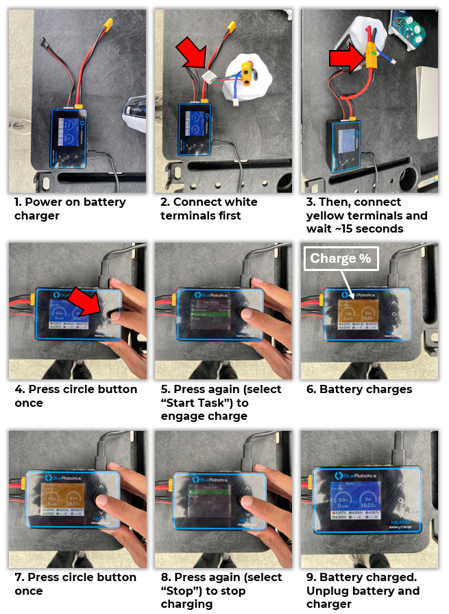 

### Cockpit User Interface (UI)

  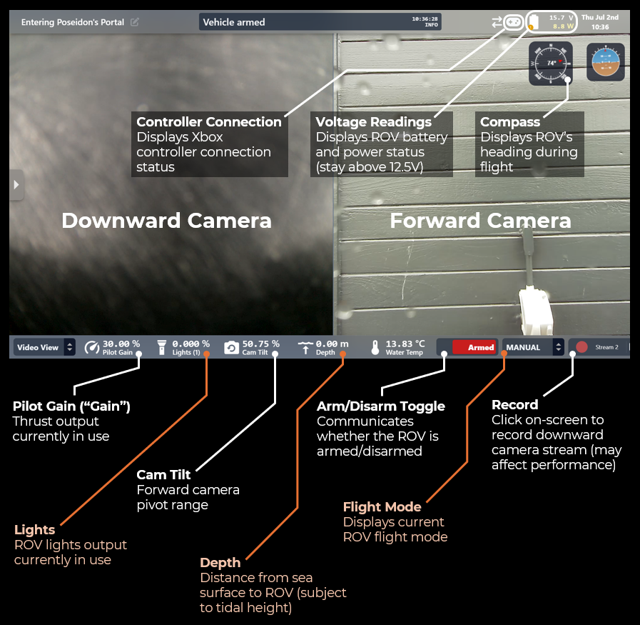 

### Piers 59 and 60 Underwater Map

  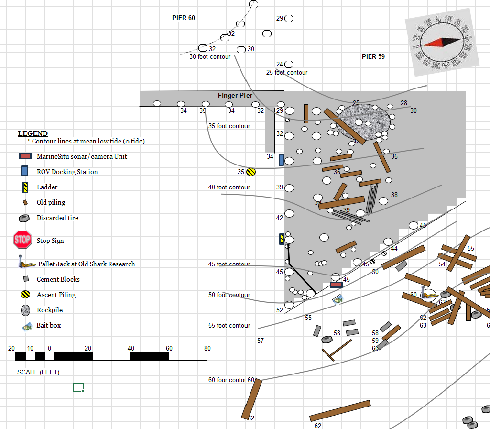 

